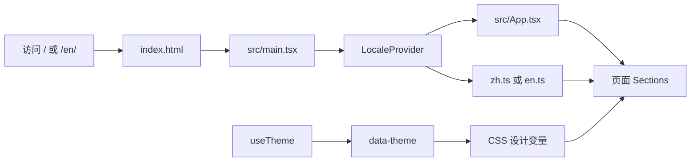
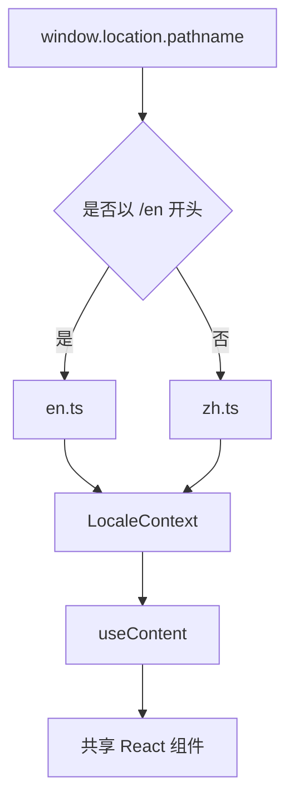
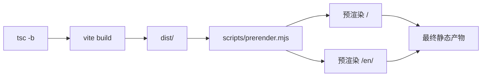

# CalcX-web 技术架构

## 架构目标

CalcX-web 是一个静态产品站。它需要同时满足四个目标：

- 首屏具有完整产品表达，而不是依赖客户端请求内容；
- 中文和英文使用独立、稳定、可索引的 URL；
- 页面结构与文案分离，便于同步维护两种语言；
- 构建产物可以部署到 GitHub Pages、Nginx 或其他静态服务器。

项目没有后端服务、数据库或运行时内容管理系统。预渲染 HTML 负责提供完整静态内容；浏览器加载脚本后，当前入口使用 `createRoot` 重新挂载 React 页面与交互，而不是使用 `hydrateRoot` 做水合。

## 运行时结构



入口 `src/main.tsx` 挂载 React，并在应用外层提供语言上下文。`src/App.tsx` 只负责组合页面区块，不直接承载产品文案。组件通过 `useContent()` 读取当前语言的结构化内容。

## 源码分层

```text
src/
├── App.tsx                    # 主页区块编排
├── main.tsx                   # React 入口与全局样式入口
├── components/
│   ├── layout/                # Header、Footer
│   ├── sections/              # 主页的独立内容区块
│   └── ui/                    # 可复用的展示与控制组件
├── animations/
│   └── gsap.ts                # GSAP、React Hook 与 ScrollTrigger 统一注册入口
├── data/
│   ├── version.ts             # 产品版本号唯一定义源
│   ├── content.types.ts       # 双语内容的共享类型
│   └── locales/               # 中文和英文内容对象
├── hooks/                     # 主题等通用状态
├── i18n/                      # URL 语言判断与内容上下文
└── styles/
    ├── tokens.css             # 颜色、间距等设计变量
    ├── global.css             # 样式聚合入口，按级联顺序导入下列文件
    ├── base.css               # 浏览器基础、全局布局与通用文字
    ├── components/            # 按钮、顶栏和页脚样式
    ├── sections/              # 各主页区块及其响应式覆盖规则
    └── animations.css         # 动效及降级处理
```

区块样式按页面职责拆分。每个 `sections/*.css` 文件同时保存该区块的桌面、平板、手机和减少动态效果规则，使同一选择器的响应式覆盖保持在一处。`global.css` 只维护导入顺序，不再直接承载页面规则。

`public/` 中的内容会原样复制到构建产物，包括产品图片、图标、法律页面、站点地图和 robots.txt。`dist/` 是构建结果，不是源码入口。

`src/animations/gsap.ts` 只负责注册和导出动效能力。需要编排动效的组件从该入口引用 `gsap`、`useGSAP` 或 `ScrollTrigger`，避免在多个组件中重复注册插件。

具体动效通过 `useGSAP` 管理组件卸载时的清理，通过 `gsap.matchMedia()` 响应断点和 `prefers-reduced-motion`。桌面端由 `ScrollSmoother` 提供平滑滚动，Showcase 使用固定场景，Technology 把纵向滚动映射为横向计算管线；Experience 在进入视口后自动依次播放，不绑定后续滚动进度。移动端不保留长距离固定，预渲染声明减少动态效果偏好，各组件在该条件下直接呈现完整静态内容。

## 页面组合

`src/App.tsx` 按顺序挂载以下组件：

| 组件 | 职责 |
| --- | --- |
| `Header` | 品牌、锚点导航、语言切换、主题切换与移动菜单 |
| `HeroSection` | 产品定位、下载入口、源码入口和关键数字 |
| `CapabilitiesSection` | 六组核心能力概览 |
| `ShowcaseSection` | 桌面固定后横向滚动四张产品卡片，移动端改为纵向排列 |
| `ExperienceSection` | 以自动播放的公式求解场景说明触屏输入、原生交互与本地优先 |
| `TechnologySection` | 横向滚动展示 CalculatorX 应用本体的技术链路 |
| `OpenSourceSection` | 开源定位与外部链接 |
| `DownloadSection` | AppGallery 和 Releases 获取入口 |
| `Footer` | 文档、法律页面、反馈和版权信息 |

区块之间没有共享的业务状态。当前主要交互状态只有移动菜单和主题选择；滚动进度与场景生命周期由 GSAP 上下文管理，因此不需要额外的状态管理库。

## 内容与双语机制

`SiteContent` 是中英文内容共同遵循的类型。它定义了导航、首屏、能力卡片、产品展示、体验、技术、开源、下载、页脚和界面辅助文本。



语言由当前路径决定：

- `/` 使用 `zh-CN` 内容；
- `/en/` 使用英文内容；
- 语言按钮通过页面跳转切换两个静态入口。

`LocaleProvider` 同时更新 `<html lang>`、页面标题和描述。入口 HTML 中仍保留各语言自己的静态 meta、canonical、hreflang、Open Graph、Twitter Card 与 JSON-LD，使这些信息在 JavaScript 执行前已经存在。

## 主题机制

主题状态由 `src/hooks/useTheme.ts` 管理：

1. 优先读取 `localStorage` 中的 `calcx-theme`；
2. 没有用户选择时，读取 `prefers-color-scheme`；
3. 将结果写入 `<html data-theme="light|dark">`；
4. CSS 通过设计变量切换颜色和界面层次；
5. 只有在用户尚未固定选择时，系统主题变化才会继续同步。

两个入口 HTML 还包含一段很小的同步脚本，在 React 启动前设置主题，降低首屏明暗闪烁。

产品视觉可以同时提供浅色和深色图片。`ProductVisual` 会分别检测两张图片是否加载成功：单张缺失时复用可用图片，两张都缺失时显示内置公式视觉，避免整个展示区出现破图。

## 路由与静态页面

项目没有引入客户端路由库。路由由静态文件和服务器路径共同形成：

- `index.html` 对应 `/`；
- `en/index.html` 对应 `/en/`；
- `public/privacy/index.html` 对应 `/privacy/`；
- `public/agreement/index.html` 对应 `/agreement/`；
- `public/help/index.html` 对应 `/help/`，并跳转至 `/docs`。

`/docs` 不由本仓库生成。生产环境需要把该路径交给 CalcX-docs 的部署结果。

## 构建与预渲染

`npm run build` 串联三个阶段：



1. `tsc -b` 检查 TypeScript 项目；
2. Vite 以 `index.html` 和 `en/index.html` 为两个入口生成 `dist/`；
3. `scripts/prerender.mjs` 在本地 4173 端口临时托管 `dist/`；
4. Puppeteer 以减少动态效果模式依次访问 `/` 和 `/en/`，等待网络空闲后把完整 DOM 写回对应 HTML；
5. 临时浏览器和服务器关闭，`dist/` 成为最终部署目录。

预渲染脚本优先读取 `PUPPETEER_EXECUTABLE_PATH`，随后检查 Windows 上常见的 Chrome 与 Edge 路径。在 CI 中，Puppeteer 可以使用依赖安装阶段准备的浏览器。

## 部署链路

`.github/workflows/deploy.yml` 在 `main` 分支发生 push 时执行：

1. 使用 Node.js 20 和 `npm ci` 安装依赖；
2. 执行完整生产构建；
3. 将 `dist/` 上传并发布到 GitHub Pages；
4. 校验阿里云 ECS 的 SSH 主机指纹；
5. 先把产物上传到服务器暂存目录，再替换 `/var/www/calcx.startyi.cn` 中的网站内容。

同一份 `dist/` 被用于两个部署目标，因此本地构建结果也是排查线上静态内容问题的基准。阿里云部署需要仓库密钥 `ALIYUN_SSH_KEY`；密钥值不属于源码或文档内容。

## 外部边界

本网站依赖若干外部目标，但不控制它们的内容：

| 目标 | 本仓库中的用途 |
| --- | --- |
| CalculatorX 主仓库 | 源码入口、Releases，以及产品事实的权威来源 |
| CalcX-docs | `/docs` 下的用户帮助 |
| AppGallery | 面向普通用户的安装与更新入口 |
| GitHub Issues | 问题反馈入口 |

核心页面本身不请求业务 API。网站提到的联网汇率、缓存和计算架构都是 CalculatorX 应用的能力，不是 CalcX-web 在浏览器中实现的功能。

## 常见修改入口

| 想要修改的内容 | 主要入口 |
| --- | --- |
| 中文或英文产品文案 | `src/data/locales/zh.ts`、`src/data/locales/en.ts` |
| 内容字段或展示数据结构 | `src/data/content.types.ts` |
| 首页区块顺序 | `src/App.tsx` |
| 某个区块的交互或标记 | `src/components/sections/` |
| 导航、页脚或主题按钮 | `src/components/layout/`、`src/components/ui/` |
| 颜色、排版和响应式布局 | `src/styles/` |
| GSAP 动效注册与 ScrollTrigger | `src/animations/gsap.ts` |
| SEO 与分享摘要 | `index.html`、`en/index.html` |
| 静态法律页和旧入口 | `public/` |
| 多页面输出 | `vite.config.ts` |
| 构建后 HTML 生成 | `scripts/prerender.mjs` |
| 自动部署 | `.github/workflows/deploy.yml` |

这张表描述的是当前源码职责，而不是一套固定不变的贡献规范。架构发生变化时，应让文档跟随实现更新。

## 关键设计取舍

- **静态多页面而不是 SPA 路由**：两个语言入口在部署和索引层面都是真实 HTML 路径。
- **内容对象而不是组件内硬编码**：中文和英文共享布局，也能通过 TypeScript 保持字段一致。
- **预渲染而不是纯客户端输出**：静态托管仍能获得完整主页 HTML。
- **原生 CSS 而不是 UI 框架**：设计变量和响应式行为由项目直接控制。
- **外部文档而不是官网内复制**：产品介绍与详细帮助保持清晰边界。
- **视觉降级而不是阻断构建**：产品图片不完整时仍能展示有意义的占位内容。

这些取舍共同服务于一个目标：让网站保持轻量、可部署、易理解，同时让产品内容能够随着 CalculatorX 快速演进。
